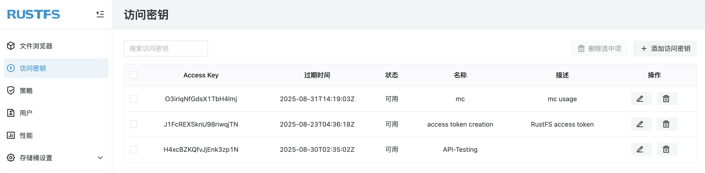
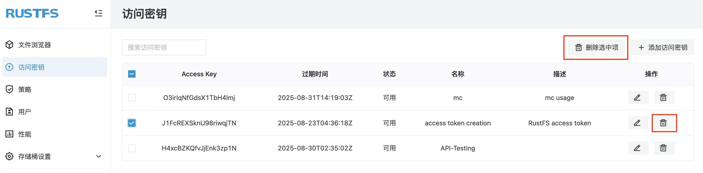

# 访问密钥

RustFS 访问密钥是RustFS 系统的核心凭据，用于对身份进行认证和操作进行授权，在 API 和 SDK 场景下非常有用。本章节介绍 RustFS 访问密钥的创建和删除。

前提条件：

- 一个可用的 RustFS 实例。可参考[安装指南](../../installation/index.md)进行安装。

## 创建访问密钥

1. 登录 RustFS UI 控制台。
1. 在左侧导航栏，选择 **访问密钥**。
1. 在访问密钥页面，右上角，点击 **添加访问密钥**。
1. 输入密钥的**过期时间、名称以及描述**，然后点击 **提交**。
1. （可选但建议）。在出现的访问密钥页面中，选择 **拷贝** 或 **导出** 来保存好访问密钥，以便在后续使用。

## 删除访问密钥

1. 登录 RustFS UI 控制台。
1. 在左侧导航栏，选择 **访问密钥**。
1. 在访问密钥页面，选择要删除的访问密钥。
1. 选择访问密钥右侧的 **删除** 按钮或右上角的 **删除选中项** 删除访问密钥。

