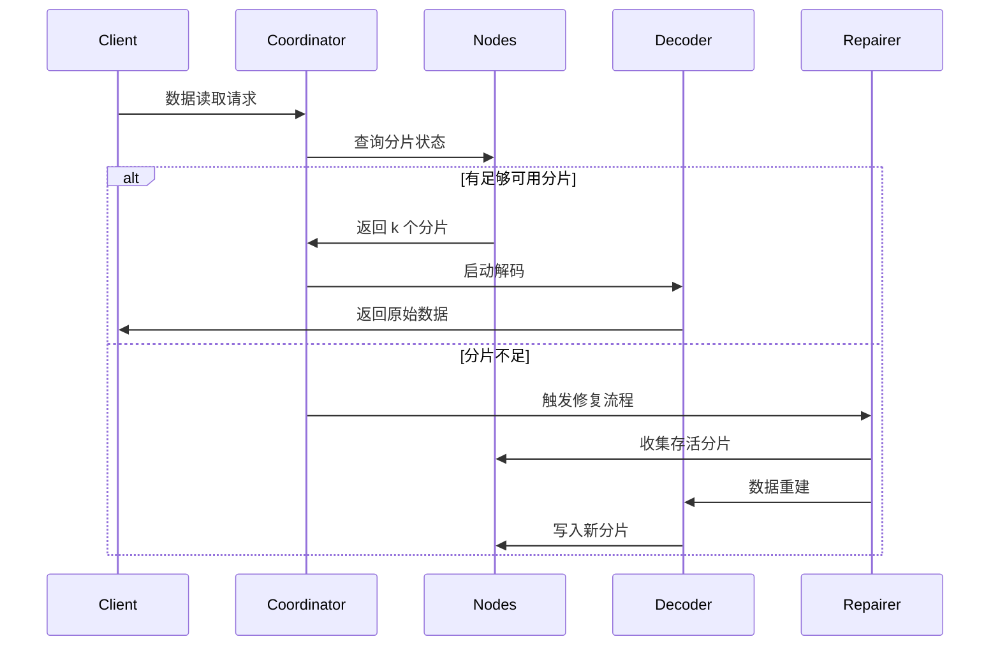

# 纠删码原理

## 一、核心算法和核心算法应用范围

里德-所罗门码（Reed-Solomon Code，RS 码）是一种基于有限域代数结构的纠删码（Erasure Code），因其**高效的数据恢复能力**和**灵活的冗余配置**，被广泛应用于多个领域。以下从技术领域和实际应用两个维度，详细说明其核心应用场景：

### 1.1. 分布式存储系统（如 RustFS）
- **数据分片与冗余**
 将原始数据分为 `k` 个分片，生成 `m` 个校验分片（总计 `n=k+m`）。任意丢失≤ `m` 个分片均可恢复数据。
 **示例**：RS(10,4) 策略允许同时丢失 4 个节点（存储利用率 71%），相比三副本（33%）节省 50% 存储空间。

- **故障恢复机制**
 通过**高斯消元法**或**快速傅里叶变换(FFT)** 算法，利用存活分片重建丢失数据，恢复时间与网络带宽成反比。

- **动态调整能力**
 支持运行时调整`(k,m)`参数，适应不同存储层级（热/温/冷数据）的可靠性需求。

### 1.2. 通信传输
- **卫星通信**
 处理深空信道中的长延时、高误码率问题（如 NASA 火星探测器使用 RS(255,223)码，纠错能力达 16 字节/码字）。

- **5G NR 标准**
 在控制信道采用 RS 码结合 CRC 校验，确保关键信令的可靠传输。

- **无线传感器网络**
 解决多跳传输中的累积丢包问题，典型配置 RS(6,2)可容忍 33%的数据丢失。

### 1.3. 数字媒体存储
- **二维码（QR Code）**
 使用 RS 码实现容错等级调节（L7%, M15%, Q25%, H30%），即使部分区域污损仍可正确解码。

- **蓝光光盘**
 采用 RS(248,216)码组合交叉交织，纠正因划痕导致的连续突发错误。

- **DNA 数据存储**
 在合成生物分子链时添加 RS 校验，抵御碱基合成/测序错误（如 Microsoft 实验项目使用 RS(4,2)）。


## 二、纠删码基础概念

### 2.1 存储冗余的演进
```rust
// 传统三副本存储
let data = "object_content";
let replicas = vec![data.clone(), data.clone(), data.clone()];
```
传统多副本方案存在存储效率低下的问题（存储利用率 33%）。纠删码技术将数据分块后计算校验信息，实现存储效率与可靠性的平衡。

### 2.2 核心参数定义
- **k**: 原始数据分片数量
- **m**: 校验分片数量
- **n**: 总分片数量（n = k + m）
- **恢复阈值**: 任意 k 个分片可恢复原始数据

| 方案类型 | 冗余度 | 故障容忍度 |
|------------|----------|------------|
| 3 副本 | 200% | 2 节点 |
| RS(10,4) | 40% | 4 节点 |

## 三、里德-所罗门码数学原理

### 3.1 有限域(Galois Field)构建
采用 GF(2^8)域（256 个元素），满足：
```math
α^8 + α^4 + α^3 + α^2 + 1 = 0
```
生成元多项式为`0x11D`，对应二进制`100011101`

### 3.2 编码矩阵构造
范德蒙矩阵示例（k=2, m=2）：
```math
G = \begin{bmatrix}
1 & 0 \\
0 & 1 \\
1 & 1 \\
1 & 2
\end{bmatrix}
```


### 3.3 编码过程
数据向量 D = [d₁, d₂,..., dk]
编码结果 C = D × G

**生成多项式插值法**：
构造通过 k 个数据点的多项式：
```math
p(x) = d_1 + d_2x + ... + d_kx^{k-1}
```
校验值计算：
```math
c_i = p(i), \quad i = k+1,...,n
```

## 四、RustFS 中的工程实现

### 4.1 数据分片策略
```rust
struct Shard {
 index: u8,
 data: Vec<u8>,
 hash: [u8; 32],
}

fn split_data(data: &[u8], k: usize) -> Vec<Shard> {
 // 分片逻辑实现
}
```
- 动态分片大小调整（64 KB-4 MB）
- 哈希校验值使用 Blake3 算法

### 4.2 并行编码优化
```rust
use rayon::prelude::*;

fn rs_encode(data: &[Shard], m: usize) -> Vec<Shard> {
 data.par_chunks(k).map(|chunk| {
 // SIMD 加速的矩阵运算
 unsafe { gf256_simd::rs_matrix_mul(chunk, &gen_matrix) }
 }).collect()
}
```
- 基于 Rayon 的并行计算框架
- 使用 AVX2 指令集优化有限域运算

### 4.3 解码恢复流程



