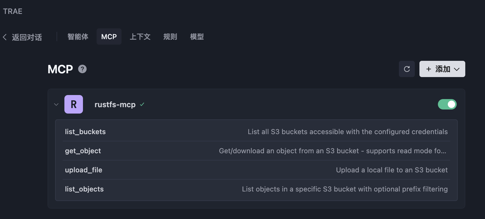
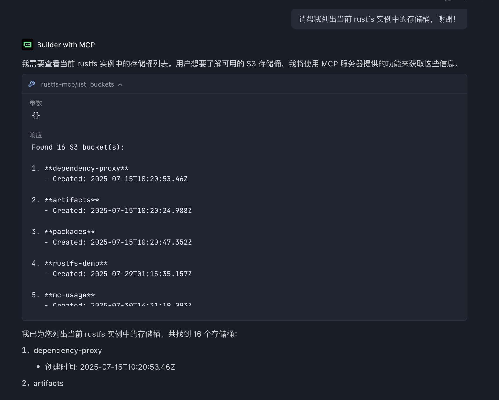

# RustFS MCP


**RustFS MCP 服务器**是一个高性能的 [模型上下文协议（MCP）](https://www.anthropic.com/news/model-context-protocol) 服务器，它为 AI/LLM 工具提供对 S3 兼容对象存储操作的无缝访问。该服务器使用 Rust 构建，以实现最大的性能和安全性，它使像 Claude Desktop 这样的 AI 助手能够通过标准化协议与云存储进行交互。

### 什么是 MCP？

模型上下文协议是一个开放标准，它使 AI 应用程序能够与外部系统建立安全、受控的连接。该服务器充当 AI 工具和 S3 兼容存储服务之间的桥梁，提供对文件操作的结构化访问，同时保持安全性和可观察性。


## ✨ 特性

### 支持的 S3 操作

  - **列出存储桶**：列出所有可访问的 S3 存储桶
  - **列出对象**：通过可选的前缀过滤浏览存储桶内容
  - **上传文件**：上传本地文件，并自动检测 MIME 类型和缓存控制
  - **获取对象**：从 S3 存储中检索对象，支持读取或下载模式


## 🔧 安装

### 先决条件

  - Rust 1.88+（用于从源代码构建）
  - 已配置 AWS 凭据（通过环境变量、AWS CLI 或 IAM 角色）
  - 访问 S3 兼容存储服务

### 从源代码构建

```bash
# 克隆仓库
git clone https://github.com/rustfs/rustfs.git
cd rustfs

# 构建 MCP 服务器
cargo build --release -p rustfs-mcp

# 二进制文件将在以下路径可用
./target/release/rustfs-mcp
```


## ⚙️ 配置

### 环境变量

```bash
# AWS 凭据（必填）
export AWS_ACCESS_KEY_ID=您的访问密钥
export AWS_SECRET_ACCESS_KEY=您的密钥
export AWS_REGION=us-east-1  # 可选，默认为 us-east-1

# 可选：自定义 S3 端点（用于 MinIO 等）
export AWS_ENDPOINT_URL=http://localhost:9000

# 日志级别（可选）
export RUST_LOG=info
```

### 命令行选项

```bash
rustfs-mcp --help
```

服务器支持各种命令行选项来定制行为：

  - `--access-key-id`：S3 认证的 AWS 访问密钥 ID
  - `--secret-access-key`：S3 认证的 AWS 密钥
  - `--region`：用于 S3 操作的 AWS 区域（默认：us-east-1）
  - `--endpoint-url`：自定义 S3 端点 URL（用于 MinIO、LocalStack 等）
  - `--log-level`：日志级别配置（默认：rustfs\_mcp\_server=info）

-----

## 🚀 使用

### 启动服务器

```bash
# 启动 MCP 服务器
rustfs-mcp

# 或使用自定义选项
rustfs-mcp --log-level debug --region us-west-2
```

### 与聊天客户端集成

#### 选项 1：使用命令行参数

```json
{
  "mcpServers": {
    "rustfs-mcp": {
      "command": "/path/to/rustfs-mcp",
      "args": [
        "--access-key-id", "您的访问密钥",
        "--secret-access-key", "您的密钥",
        "--region", "us-west-2",
        "--log-level", "info"
      ]
    }
  }
}
```

#### 选项 2：使用环境变量

```json
{
  "mcpServers": {
    "rustfs-mcp": {
      "command": "/path/to/rustfs-mcp",
      "env": {
        "AWS_ACCESS_KEY_ID": "您的访问密钥",
        "AWS_SECRET_ACCESS_KEY": "您的密钥",
        "AWS_REGION": "us-east-1"
      }
    }
  }
}
```

### 在 Docker 中使用

[RustFS MCP 官方提供 Dockerfile](https://github.com/rustfs/rustfs/tree/main/crates/mcp)，可以使用 Dockerfile 构建容器镜像来使用 RustFS MCP。

```
# 克隆 RustFS 仓库代码
git clone git@github.com:rustfs/rustfs.git

# 构建 Docker 镜像
docker build -f crates/mcp/Dockerfile -t rustfs/rustfs-mcp .
```

构建成功后可以在 AI IDE 的 MCP 配置中配置使用。

#### 在 AI IDE 中配置 MCP

目前主流的 AI IDE，诸如 Cursor、Windsurf、Trae 等都支持 MCP。比如，在 Trae 中，将如下内容添加到 MCP 配置中（**MCP --> 添加**）：

```
{
  "mcpServers": {
    "rustfs-mcp": {
      "command": "docker",
      "args": [
        "run",
        "--rm",
        "-i",
        "-e",
        "AWS_ACCESS_KEY_ID",
        "-e",
        "AWS_SECRET_ACCESS_KEY",
        "-e",
        "AWS_REGION",
        "-e",
        "AWS_ENDPOINT_URL",
        "rustfs/rustfs-mcp"
      ],
      "env": {
        "AWS_ACCESS_KEY_ID": "rustfs_access_key",
        "AWS_SECRET_ACCESS_KEY": "rustfs_secret_key",
        "AWS_REGION": "cn-east-1",
        "AWS_ENDPOINT_URL": "rustfs_instance_url"
      }
    }
  }
}
```

> `AWS_ACCESS_KEY_ID` 和 `AWS_SECRET_ACCESS_KEY` 是 RustFS 的访问密钥，可以参考[访问密钥的管理章节](../administration/iam/access-token.md)进行创建。

如果添加成功，可以在 MCP 配置页面列出[可用的工具](#️-可用工具)。



在 Trae 中，输入对应的提示词就可以使用对应的工具（Tool）了。比如在 Trae 的聊天对话框中输入：

```
请帮我列出当前 rustfs 实例中的存储桶，谢谢！
```

返回如下响应：




Trae 使用 **Builder with MCP** 模式，调用了 `list_buckets` 工具，列出了配置 RustFS 实例中所有的存储桶。对于其他工具的调用也是一样的。

## 🛠️ 可用工具

MCP 服务器公开了 AI 助手可以使用的以下工具：

### `list_buckets`

列出使用已配置凭据可访问的所有 S3 存储桶。

**参数**：无

### `list_objects`

列出 S3 存储桶中的对象，支持可选的前缀过滤。

**参数**：

  - `bucket_name` (字符串)：S3 存储桶的名称
  - `prefix` (字符串, 可选)：用于过滤对象的前缀

### `upload_file`

将本地文件上传到 S3，并自动检测 MIME 类型。

**参数**：

  - `local_file_path` (字符串)：本地文件路径
  - `bucket_name` (字符串)：目标 S3 存储桶
  - `object_key` (字符串)：S3 对象键（目标路径）
  - `content_type` (字符串, 可选)：内容类型（如果未提供则自动检测）
  - `storage_class` (字符串, 可选)：S3 存储类别
  - `cache_control` (字符串, 可选)：缓存控制头

### `get_object`

从 S3 检索对象，有两种操作模式：直接读取内容或下载到文件。

**参数**：

  - `bucket_name` (字符串)：源 S3 存储桶
  - `object_key` (字符串)：S3 对象键
  - `version_id` (字符串, 可选)：版本化对象的版本 ID
  - `mode` (字符串, 可选)：操作模式 - "read"（默认）直接返回内容，"download" 保存到本地文件
  - `local_path` (字符串, 可选)：本地文件路径（当模式为 "download" 时必填）
  - `max_content_size` (数字, 可选)：读取模式的最大内容大小（字节）（默认：1MB）

### `create_bucket`

创建一个新的 RustFS 存储桶。

**参数**：

  - `bucket_name` (字符串)：要创建的存储桶名称。

### `delete_bucket`

删除指定的 RustFS 存储桶。

**参数**：

  - `bucket_name` (字符串)：要删除的存储桶名称。

## 架构

MCP 服务器采用模块化架构构建：

```
rustfs-mcp/
├── src/
│   ├── main.rs          # 入口点、CLI 解析和服务器初始化
│   ├── server.rs        # MCP 服务器实现和工具处理器
│   ├── s3_client.rs     # 带有异步操作的 S3 客户端包装器
│   ├── config.rs        # 配置管理和 CLI 选项
│   └── lib.rs           # 库导出和公共 API
└── Cargo.toml           # 依赖项、元数据和二进制配置
```

