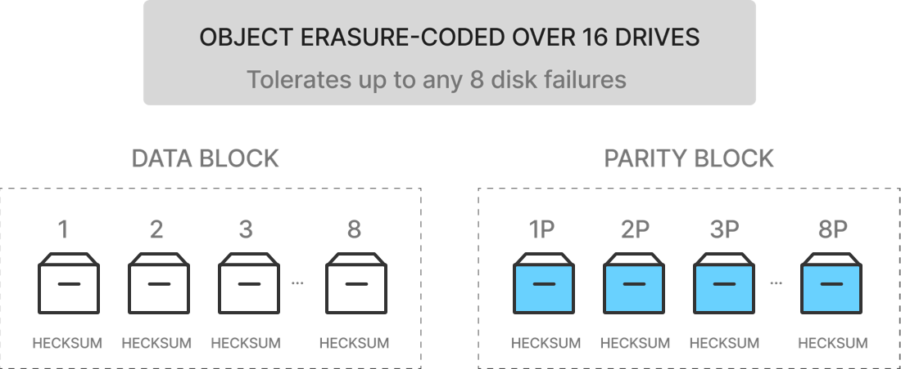
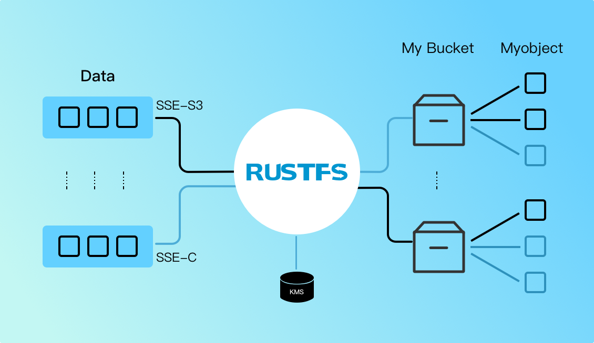
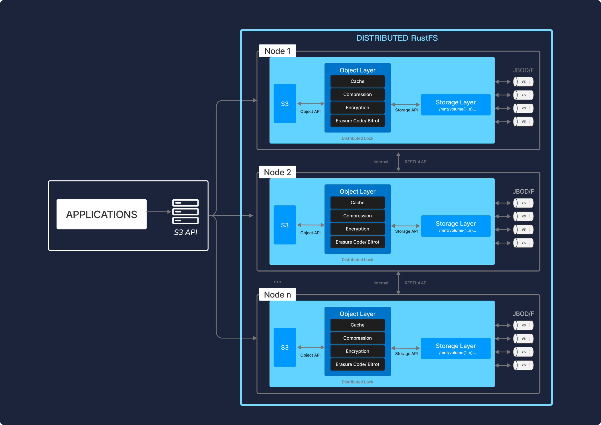

# 支持 Windows/Linux 的裸金属和虚拟化部署

开源，兼容 S3，企业强化，而且速度非常快。

RustFS 是一种高性能的分布式对象存储系统。它是软件定义的，在行业标准硬件上运行，并且是 100% 开源的，主要许可证是 Apache V2.0 开源许可证。

RustFS 的不同之处在于，它从一开始就被设计为私有云/混合云对象存储的标准。由于 RustFS 是专门为仅服务对象而构建的，因此单层架构可以实现所有必要的功能，而不会影响性能。其结果是一个同时具有高性能、可扩展性和轻量级的云原生对象服务器。

虽然 RustFS 在辅助存储、灾难恢复和归档等传统对象存储用例方面表现出色，但它在克服与机器学习、分析和云原生应用程序工作负载相关的挑战方面独树一帜。

## 核心特征

### 纠删码

RustFS 使用汇编代码编写的每个对象的内联纠删编码来保护数据，以提供尽可能高的性能。RustFS 使用 Reed-Solomon 代码将对象条带化为具有用户可配置冗余级别的数据和奇偶校验块。RustFS 的纠删编码在对象级别执行修复，并且可以独立修复多个对象。

在 N/2 的最大奇偶校验下，RustFS 的实现可以确保在部署中仅使用 ((N/2)+1) 个操作驱动器进行不间断的读取和写入操作。例如，在 12 个驱动器设置中，RustFS 在 6 个数据驱动器和 6 个奇偶校验驱动器之间对对象进行分片，并且可以在部署中仅剩下 7 个驱动器的情况下可靠地写入新对象或重建现有对象。

### Bitrot 保护

静默数据损坏或 bitrot 是磁盘驱动器面临的一个严重问题，导致数据在用户不知情的情况下损坏。原因是多方面的（驱动器老化、电流峰值、磁盘固件错误、幻像写入、错误定向的读/写、驱动程序错误、意外覆盖），但结果是一样的——数据泄露。

RustFS 对 HighwayHash 算法的优化实现确保它永远不会读取损坏的数据 - 它可以即时捕获和修复损坏的对象。通过计算 READ 上的哈希值并在 WRITE 上从应用程序、网络到内存/驱动器验证它，确保端到端的完整性。该实现专为速度而设计，可以在 Intel CPU 上的单个内核上实现超过 10 GB/秒的哈希速度。

### 服务器端加密

在飞行中加密数据是一回事；保护静态数据是另一回事。RustFS 支持多种复杂的服务器端加密方案来保护数据 - 无论数据位于何处。RustFS 的方法确保了机密性、完整性和真实性，性能开销可以忽略不计。使用 AES-256-GCM、ChaCha20-Poly1305 和 AES-CBC 支持服务器端和客户端加密。

加密对象使用 AEAD 服务器端加密进行防篡改。此外，RustFS 与所有常用的密钥管理解决方案（例如 HashiCorp Vault）兼容并进行了测试。RustFS 使用密钥管理系统 (KMS) 来支持 SSE-S3。

如果客户端请求 SSE-S3 或启用自动加密，RustFS 服务器会使用唯一的对象密钥对每个对象进行加密，该密钥由 KMS 管理的主密钥保护。鉴于开销极低，可以为每个应用程序和实例启用自动加密。

### WORM (Write Once Read Many)

#### 身份管理

RustFS 支持身份管理中最先进的标准，可与 OpenID connect 兼容提供商以及主要外部 IDP 供应商集成。这意味着访问是集中的，密码是临时的和轮换的，而不是存储在配置文件和数据库中。此外，访问策略是细粒度和高度可配置的，这意味着支持多租户和多实例部署变得简单。

#### 连续复制

传统复制方法的挑战在于，它们不能有效地扩展到几百 TiB 以上。话虽如此，每个人都需要一个复制策略来支持灾难恢复，并且该策略需要跨越地理位置、数据中心和云。

RustFS 的持续复制专为大规模、跨数据中心部署而设计。通过利用 Lambda 计算通知和对象元数据，它可以高效、快速地计算增量。Lambda 通知可确保立即传播更改，而不是传统的批处理模式。

连续复制意味着在发生故障时，数据丢失将保持在最低限度 - 即使面对高度动态的数据集也是如此。最后，与 RustFS 所做的一切一样，连续复制是多供应商的，这意味着您的备份位置可以是从 NAS 到公共云的任何位置。

#### 全球联合

现代企业的数据无处不在。RustFS 允许将这些不同的实例组合在一起，以形成一个统一的全局命名空间。具体而言，任意数量的 RustFS 服务器可以组合成一个分布式模式集，多个分布式模式集可以组合成一个 RustFS 服务器联合。每个 RustFS 服务器联合都提供统一的管理员和命名空间。

RustFS 联合服务器支持无限数量的分布式模式集。这种方法的影响是，对象存储可以针对地理位置分散的大型企业进行大规模扩展，同时保留从单个控制台容纳各种应用程序（Splunk、Teradata、Spark、Hive、Presto、TensorFlow、H20）的能力。

#### 多云网关

所有企业都在采用多云战略。这也包括私有云。因此，您的裸机虚拟化容器和公共云服务（包括 Google、Microsoft 和阿里巴巴等非 S3 提供商）必须看起来相同。虽然现代应用程序具有高度可移植性，但为这些应用程序提供支持的数据却并非如此。

无论数据位于何处，都提供这些数据是 RustFS 解决的主要挑战。RustFS 在裸机、网络连接存储和每个公共云上运行。更重要的是，RustFS 通过 Amazon S3 API 确保您从应用程序和管理的角度来看，该数据的视图看起来完全相同。

RustFS 可以走得更远，使您现有的存储基础设施与 Amazon S3 兼容。其影响是深远的。现在，组织可以真正统一其数据基础设施 - 从文件到块，所有数据都显示为可通过 Amazon S3 API 访问的对象，而无需迁移。

启用 WORM 后，RustFS 将禁用所有可能改变对象数据和元数据的 API。这意味着数据一旦写入就变得防篡改。这在许多不同的监管要求中都有实际应用。

## 系统架构

RustFS 被设计为云原生，可以作为由 Kubernetes 等外部编排服务管理的轻量级容器运行。整个服务器是一个约 40 MB 的静态二进制文件，即使在高负载下也能高效地使用 CPU 和内存资源。结果是，您可以在共享硬件上共同托管大量租户。

RustFS 在具有本地连接驱动器 (JBOD/JBOF) 的商用服务器上运行。群集中的所有服务器在功能上都是相等的（完全对称的体系结构）。没有名称节点或元数据服务器。

RustFS 将数据和元数据作为对象一起写入，无需元数据数据库。此外，RustFS 将所有功能（纠删编码、bitrot 检查、加密）作为内联、严格一致的操作执行。其结果是，RustFS 具有非凡的弹性。

每个 RustFS 集群都是分布式 RustFS 服务器的集合，每个节点有一个进程。RustFS 在用户空间中作为单个进程运行，并使用轻量级协程实现高并发。驱动器被分组到纠删集中（默认情况下每组 16 个驱动器），并使用确定性哈希算法将对象放置在这些集上。

RustFS 专为大规模、多数据中心云存储服务而设计。每个租户都运行自己的 RustFS 集群，与其他租户完全隔离，使他们能够保护他们免受升级、更新和安全事件的任何中断。每个租户通过跨地理位置联合群集来独立缩放。
