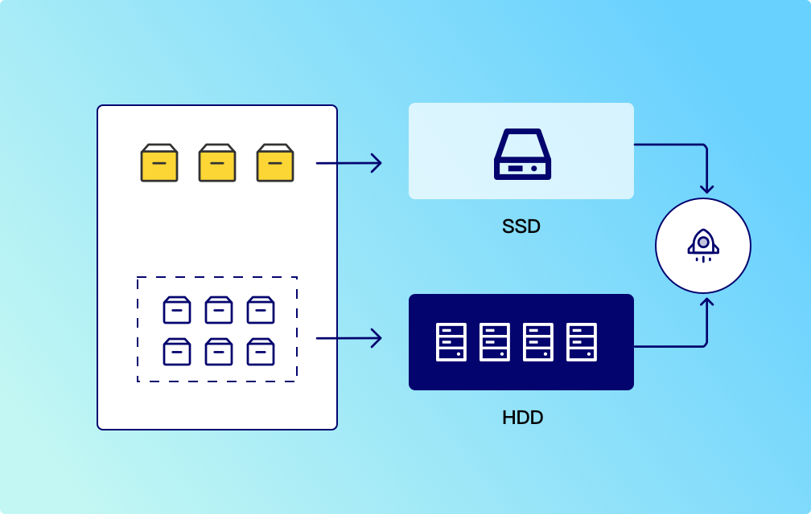
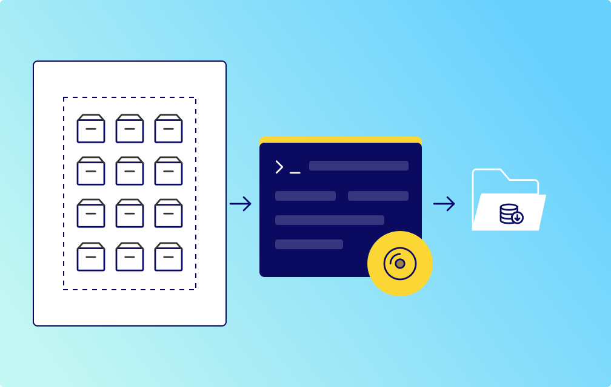
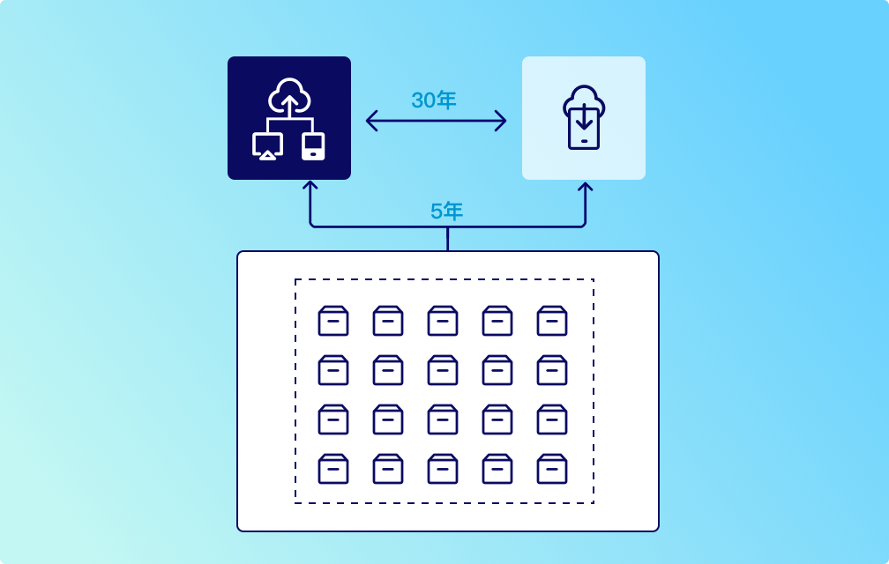
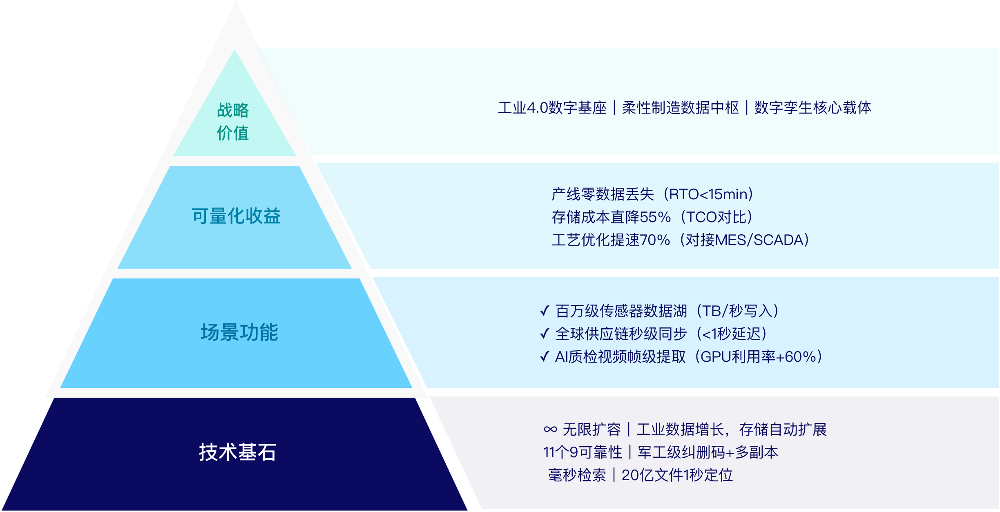

# 工业生产解决方案

工业生产中海量数据的存储、质检、追踪等海量数据的长久保存，降本增效

## 工业生产四大核心痛点

| 痛点 | 具体场景/挑战 | 用户需求 |
|------|-------------|----------|
| **海量数据存储与扩展性** | 工业生产中传感器、设备产生 PB 级数据，传统存储扩展难、成本高。 | 弹性扩展存储容量，支持动态增长，降低硬件投入与维护成本。 |
| **实时处理与低延迟** | 实时监控、预测性维护等场景需毫秒级数据读写，传统存储延迟高 影响决策效率。 | 高并发读写能力，支持实时数据分析与边缘计算，缩短响应时间。 |
| **​数据安全与合规性** | 工业数据涉及核心工艺参数，需满足 GDPR、ISO 27001 等法规， 防泄露与篡改。 | 端到端加密、细粒度权限控制、审计日志，确保数据全生命周期合规。 |
| **​多源异构数据整合** | 工业环境存在 S3、NFS、数据库等多种协议/格式数据，分散存储 导致管理复杂、利用率低。 | 统一存储平台兼容多协议接入，实现数据集中管理与跨系统无缝调用。 |

## 解决方案

### SSD 和 HDD 分层存储降低成本

SSD 提供快速的读写速度，适合需要高 I/O 性能的应用，而 HDD 则成本较低，适合大容量存储。通过将频繁访问的数据存储在 SSD 上，而将不经常访问的数据存储在 HDD 上，可以在不牺牲性能的情况下降低成本。

#### 分层存储核心优势

- **性能不妥协**：实现业务所需 SSD 加速
- **成本砍半**：HDD 使用 70%性能数据
- **自动运维**：AI 预测数据生命周期
- **弹性扩展**：按需扩容+综合云接入
- **风险分散**：介质备份+数据镜像
- **绿色低碳**：节能降耗+低碳利用

#### 用 SSD 保性能，用 HDD 降成本，通过智能分层实现存储支出的"好钢用在刀刃上"

#### SSD+HDD 分层存储 vs 单一存储方案成本对比表

| 对比项 | 纯 SSD 方案 | 纯 HDD 方案 | 分层存储方案 |
|--------|-----------|-----------|-------------|
| **存储介质成本** | 极高（$6~8/GB） | 极低（$0.03/GB） | 混合成本(SSD 仅存 20%热数据) |
| **性能表现** | 0.1ms 延迟 | 8~10ms 延迟 | 热数据 0.15ms，冷数据按需读取 |
| **能耗（1PB/年）** | 25 万度 | 30 万度 | 12 万度（SSD 低功耗+HDD 休眠） |
| **容量扩充成本** | 许整体扩容 | 性能瓶颈 | 按层扩容（如单独扩展 HDD 层） |
| **5 年 TCO（总成本）** | $670 万 | $200 万 | $265 万（省 60% vs SSD） |
| **适用场景** | 实时交易、高频读写 | 归档、备份 | 90%企业级混合负载（数据库/文件服务） |

### 冷备存储降低成本

与传统的磁带存储相比，蓝光光盘的存储成本较低，尤其是在大量存储时，蓝光技术的成本效益使其成为大规模数据归档的理想选择。

蓝光存储设备在运行时的能耗远低于硬盘驱动器（HDD）或固态硬盘（SSD），这意味着能源成本较低。

#### 冷备存储核心优势

- **更低成本**：蓝光光盘每 GB 成本仅为原硬盘方案的 15%
- **长期可靠**：无需定期数据迁移
- **合规安全**：军工级加密保护

#### 冷备存储通过智能分层与弹性扩展，将低频工业数据归档成本降低 60%，兼顾安全合规与资源高效利用

#### 成本对比（1PB/5 年）

| 介质 | 总成本 | 能耗 | 寿命 |
|------|--------|------|------|
| **蓝光存储** | ¥220 万 | 1200 度 | 50 年+ |
| **磁带** | ¥300 万 | 2800 度 | 30 年 |
| **HDD 系列** | ¥493 万 | 6500 度 | 5 年 |

### 多云转换降低成本

云存储通过整合动态调度数据资源完成降本增效，按需分配冷热数据存储网络，根据每一云厂商方案计算，利用标准化接口域就近优选路径，完成组合预留/弹性实例优化开支。

同时支撑工业物联网数据、服务影像等非结构化数据和原子数据云与端计算，在领域业务连续性的基础上，使存储成本降低 20%~40%，构建最具价格竞争基础设施。

#### 多云转换核心优势

- **专利跨云调度算法**：关键业务弹性 SSD 加速
- **30%成本节省承诺**：HDD 承载 70%低频数据
- **8 大行业即用方案**：AI 预测数据生命周期

### 技术价值金字塔

基于军工级可靠性与无限扩展的分布式对象存储技术，实现工业数据智能生产全链路零损耗，支撑 AI 质检与全球供应链实时协同，驱动制造企业向工业 4.0 敏捷进化
