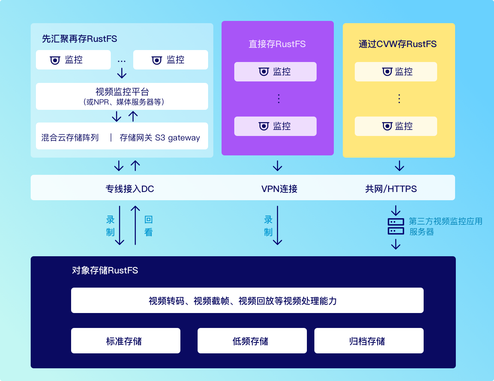

# 视频存储降本解决方案

通过对象存储和混合云的方式，帮助视频存储实现极剧降本

## 视频存储的核心痛点

### 传统方案缺陷

- 线性存储架构导致读写速度随容量增加而下降
- 原始视频占用空间，冷数据长期占用高性能存储
- 单副本存储+周期性备份机制
- 存储扩容需停机维护，缺乏智能管理工具

### 带来的业务影响

- 关键画面调取延迟超 5 秒，应急响应效率降低 30%
- 存储成本年增长达 47%，80%存储资源被低频访问视频占据
- 硬件故障导致 72 小时数据恢复周期，关键证据丢失风险
- 每 TB 存储人工运维成本高达$3.2/月，系统可用性低于 99%

## 五大核心降本能力

### 存储成本直降 68%

- 独创视频帧级压缩算法（VFC-3 专利技术）
- 智能冷热分离：自动识别 30 天未访问视频转冰川存储
- 支持 EB 级存储扩容，单 TB 成本低至$0.015/月

### 分钟级数据存取

- 全球部署 128 个边缘节点，传输速度提升 5 倍
- 支持 2000+设备并发写入，读写延迟小于 300ms
- 智能预加载技术：高频访问视频自动缓存至边缘节点

### 军工级数据保护

- 三副本存储+异地容灾（符合 ISO27001/等保 3 级）
- 区块链存证：关键视频生成时间戳哈希，司法级可信存证
- 版本回溯：120 天内任意时间点视频恢复

### 零改造接入

- 兼容 ONVIF/RTSP/GB28181 等 14 种协议
- 提供 SDK/API/RESTful 三种接入方式
- 存量数据一键迁移工具（支持 NAS/SAN/Ceph）

### 智能运维看板

- 实时监控存储健康度、成本分布、访问热点
- 容量预测算法：提前 3 天预警存储瓶颈
- 自动生成月度优化建议报告

## 解决方案

前端监控视频可通过三种方式上云

### 混合云分级存储

适用场景：大型园区、智慧城市（1000+摄像头）

#### 核心能力

- 智能分层：热数据存于地 SSD（响应小于 100ms），全量数据自动同步云端
- 成本直降：云端存储成本$0.021/GB-月，带宽占用减少 80%
- 无缝容灾：本地与云端数据实时双活

### 云端直存

适用场景：商铺、社区、家庭（50-200 摄像头）

#### 核心优势

- 5 分钟极简部署：扫码即用，自动适配 H.265 压缩
- 智能管理：移动侦测自动生成 30 秒事件片段
- 零运维：全托管云存储，数据持久性 99.9999999%

### 服务器中转存储

适用场景：教育园区、跨区域企业

#### 关键技术

- 边缘预处理：视频抽帧分析（节省 90%流量）
- 智能路由：自动切换 TCP/UDP 协议保障传输
- 分级归档：原始视频存 30 天，低码流副本存 180 天

## 为什么选择我们

### 成本可控

EB 级弹性扩容，冷数据存储成本低至$0.015/GB·月

### 极速响应

全球 128 个边缘节点，视频传输速度提升 5 倍

### 视频上传自动加密

视频自动加密可保障上传存储安全，防止数据泄露及非法传播，同时助力平台满足隐私保护法规要求，降低法律风险

### 版本保护

平台提供的原创视频自动加密服务，可有效防盗版、防篡改，保护知识产权，同时提升用户信任度和满意度

## 技术参数对比表

