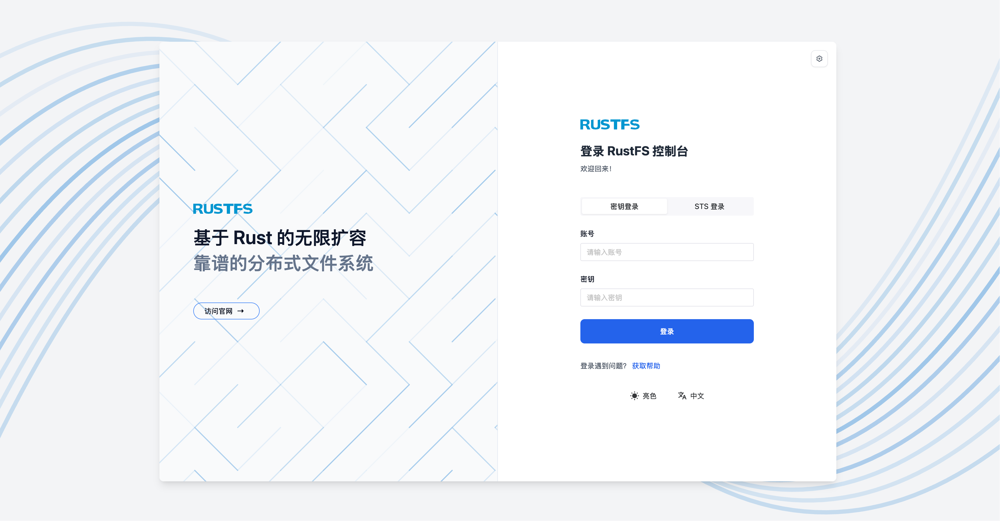

# 多机多盘（MNMD， Multiple Node Multiple Disk）


## 一、安装前必读

本文档包含RustFS多机多盘的模式部署，多机多盘适合企业级可用的性能、安全性和扩展性。并且，提供了生产工作负载需要的架构图。请装前请阅读，我们的启动模式与检查清单，如下：

1. 请明确您的三种安装启用模式：

   
     - [单机单盘模式（SNSD）](./single-node-single-disk.md)   
     - [单机多盘模式（SNMD）](./single-node-multiple-disk.md)
     - [多机多盘模式（MNMD）](./multiple-node-multiple-disk.md)  (当前文档)
   

2. [安装前检查](../checklists/index.md)，确保各项指标符合生产指导特征，若不需要生产标准可不阅读此指导；


最少需要 **4台服务器**，最低每台服务器需要 1 块磁盘，才可以安全的启动分布式对象存储集群。

以下架构图例，数据通过负载均衡，随机向任何一台服务器写入数据。以默认 12 + 4 的模式。 一个数据块默认会切分成 12 个数据块 + 4 个校验块，分别存到不同服务器的不同磁盘上。

任何 1 台服务器损坏或者维护都不会影响到数据安全。

任何 4 块磁盘以内的数据损坏都不会影响数据安全。


## 二、先决条件

1. 操作系统版本；

2. 防火墙；

3. 主机别名或者域名解析；

4. 内存条件；

5. 时间同步；

6. 容量规划；

7. 磁盘规划；

8. 文件系统规划；


### 2.1. 操作系统版本

我们推荐 Linux 内核为 4.x 及以上的版本。因为，5.x / 6.x 的版本可以获得更好的 IO 吞吐和网络性能。

您可以使用 Ubuntu 22.04 和 RHEL8.x 来安装 RustFS。

### 2.2 防火墙

Linux 系统默认开启防火墙，您可以使用以下命令查看防火墙状态：

```bash
systemctl status firewalld
```

如果您的防火墙状态为“active”，您可以使用以下命令禁用防火墙：

```bash
systemctl stop firewalld
systemctl disable firewalld
```

或者放行 RustFS 的 9000 端口：

```bash
firewall-cmd --zone=public --add-port=9000/tcp --permanent
firewall-cmd --reload
```

部署中的所有 RustFS 服务器 **必须** 使用相同的监听端口。如果您使用的是 9000 端口，其他服务器的所有端口均需要为 9000 端口。

### 2.3 主机名（单机单盘和单机多盘可跳过此步骤）

> 单机单盘、单机多盘不设置主机别名，请跳过此步骤。

创建 RustFS 集群必须要使用 **相同的、具备连续性** 的主机名。有两种方式实现连续性的主机名：

**1. DNS 配置：**

请配置你的DNS解析服务器，保障名字的连续性。

**2. HOSTS 配置：**

修改 /etc/hosts中的本地别名设置，具体操作如下：


```bash
vim /etc/hosts
127.0.0.1 localhost localhost.localdomain localhost4 localhost4.localdomain4
::1 localhost localhost.localdomain localhost6 localhost6.localdomain6
192.168.1.1 node1
192.168.1.2 node2
192.168.1.3 node3
192.168.1.4 node4
```

### 2.4 内存条件

RustFS 需要至少 2 GB 的内存来运行测试环境，生产的环境最低需要 128 GB 的内存。

### 2.5 时间同步

多节点的一致性必须要使用时间服务器维护时间的一致性，不然可能会出现无法启动服务的情况。相关时间服务器例如使用 `ntp` , `timedatectl` , 或者 `timesyncd` 。

RustFS 需要时间同步，您可以使用以下命令检查时间同步状态：

```bash
timedatectl status
```

如果状态为“synchronized”，则表示时间同步正常。


### 2.6 容量和EC规划

在规划对象存储容量的时候，我们建议您根据：

- 初始数据量: 您计划一次性迁移或存储多少数据？（例如：500 TB）
- 数据增长量：每天/每周/每月的数据增长容量；
- 规划周期: 您希望这次的硬件规划能支撑多久？（建议：3年）
- 考虑您公司的硬件迭代和更新周期。

EC（纠删码）规划如下：

| 场景	| 推荐校验级别 |	说明 |
|  -  |  - |  - | 
| 标准生产环境	| EC:4	| 能够容忍最多4块磁盘（或节点）故障，在可靠性和存储效率之间取得了很好的平衡。| 
| 高可用性要求	| EC:4 - 8 | 或更高	适用于对数据可用性要求极高的场景，但会牺牲更多的存储空间。| 
| 开发测试环境	| EC:2|  提供基本的冗余保护，适用于非关键业务。| 


### 2.7 磁盘规划

由于NFS在高IO情况下，会产生幻写和锁的问题，在使用RustFS时 **禁止使用NFS** 作为RustFS的底层存储介质。 官方强烈建议使用**JBOD（Just a Bunch of Disks）**模式，即简单磁盘捆绑。这意味着将物理磁盘直接、独立地暴露给操作系统，由RustFS软件层面负责数据冗余和保护。


原因如下：

- **性能更优：** RustFS 的纠删码（Erasure Coding）引擎经过高度优化，能够直接并发读写多块磁盘，实现比硬件RAID控制器更高的吞吐量。硬件RAID会成为性能瓶颈。
- **成本更低：** 无需昂贵的RAID卡，降低了硬件采购成本。
- **管理更简单：** 由RustFS统一管理磁盘，简化了存储层的运维。
- **故障恢复更快：** RustFS（healing）过程比传统的RAID重建（rebuild）速度更快，且对集群性能影响更小。

官方推荐在磁盘上使用NVMe SSD作为您的存储介质，保障更高的性能和吞吐能力。

### 2.8 文件系统选择

RustFS官方在磁盘文件系统格式上，RustFS官方强烈推荐在所有用于存储的磁盘上使用 XFS 文件系统。RustFS的开发和测试都基于XFS，能够确保最佳的性能和稳定性。不建议使用ext4、BTRFS或ZFS等其他文件系统，因为它们可能会导致性能下降或出现不可预知的问题。

RustFS是一个为高并发、高性能设计的对象存储系统。当客户端上传或下载大对象时，RustFS会将其分片，并以并行的方式同时读写到纠删集（Erasure Set）中的多块磁盘上。

XFS的优势：XFS（eXtents File System）从设计之初就是为了高性能和可扩展性而生。它在大文件处理和高并发I/O场景下表现极其出色。其内部的日志和数据结构（如B+树）能够高效地处理大量的并行读写请求，这与RustFS的工作模式完美契合。相比之下，虽然ext4等文件系统近年来性能有很大提升，但在面对极端并发负载时，XFS通常能提供更稳定、更优越的吞-吐量。

对象存储通常需要处理海量的文件和巨大的单个文件（TB级别）， XFS是一个64位的文件系统，能够支持极大的文件大小（高达8 EB）和文件系统规模。它的元数据管理非常高效，即使在单个目录下存放数百万个文件，其性能下降也远小于其他文件系统。这对于RustFS将每个对象（或对象的某个版本）作为一个独立文件存储在后端文件系统上的方式至关重要。

RustFS 在写入新对象或对象的版本时，为了保证写入性能和减少文件碎片，会进行空间预留， XFS提供了名为fallocate的高效API，允许应用程序预留一块连续的磁盘空间。RustFS利用这个特性，在写入文件之前就为其分配好所需的空间，避免了写入过程中因动态扩容和元数据更新带来的性能开销，同时也最大程度地减少了文件碎片的产生，保证了后续读取的性能。

为了更好的发现磁盘，在xfs文件系统格式化时我们建议使用 **Label** 标签，对磁盘进行打标。

首先，需要查看磁盘系统的情况：

```
sudo lsblk

NAME        MAJ:MIN RM   SIZE RO TYPE MOUNTPOINT
sda           8:0    0 465.7G  0 disk
├─sda1        8:1    0   512M  0 part /boot/efi
└─sda2        8:2    0 465.2G  0 part /
nvme0n1           8:16   0   3.7T  0 disk  <-- if this is our format new disk
nvme1n1           8:32   0   3.7T  0 disk  <-- if this is our format new disk
nvme2n1          8:48   0   3.7T   0  disk
```

具体格式化命令如下：

```
sudo mkfs.xfs  -i size=512 -n ftype=1 -L RUSTFS0 /dev/sdb
```

我们可以在格式化时加入一些推荐选项来优化性能:
- -L \<label\>: 为文件系统设置一个标签（label），方便后续识别和挂载。
- -i size=512: RustFS官方推荐将inode大小设置为512字节，这对于存储大量小对象（元数据）的场景有性能优势。
- -n ftype=1: 开启ftype功能。这允许文件系统在目录结构中记录文件类型，可以提高类似readdir和unlink操作的性能，对RustFS非常有利。

挂载：

```
# write new line
vim /etc/fstab
LABEL=RUSTFS0 /data/rustfs0   xfs   defaults,noatime,nodiratime   0   0

#save & exit

# mount disk
sudo mount -a 
```

## 三、配置用户名

RustFS 启动，我们建议您配置一个专门的无登录权限的用户进行启动 RustFS 的服务。在 rustfs.service 启动控制脚本中。

1. **不修改默认启动账户** ：默认的用户和用户组是 `root` 和 `root` ，若您想使用默认的`root` 和 `root`，则不需要进行任何修改。
2. **不修改默认启动账户** ：您可以使用 groupadd 和 useradd 命令创建用户和组，添加后修改 systemctl 启动配置文件的用户名和密码。


以下示例是修改创建用户、组并设置权限以访问 RustFS 指定的数据目录（可选）：

```
groupadd -r rustfs-user
useradd -M -r -g rustfs-user rustfs-user
chown rustfs-user:rustfs-user  /data/rustfs*
```

注意：
- 如果创建了rustfs-user用户和组需要将 `/etc/systemd/system/rustfs.service` 中的User 和Group改为 `rustfs-user` ;
- 将 ` /data/rustfs*`  调整为指定的挂载目录。

## 四、下载安装包

请先安装 wge 或者 curl 下载 rustfs 安装包。

```bash
# 下载地址
wget https://dl.rustfs.com/artifacts/rustfs/release/rustfs-linux-x86_64-musl-latest.zip
unzip rustfs-linux-x86_64-musl-latest.zip
chmod +x rustfs
mv rustfs /usr/local/bin/
```

### 五、配置环境变量

1. 创建配置文件 


```bash
# 多机多盘模式
sudo tee /etc/default/rustfs <<EOF
RUSTFS_ACCESS_KEY=rustfsadmin
RUSTFS_SECRET_KEY=rustfsadmin
RUSTFS_VOLUMES="http://node{1...4}:9000/data/rustfs{0...3}"
RUSTFS_ADDRESS=":9000"
RUSTFS_CONSOLE_ENABLE=true
RUST_LOG=error
RUSTFS_OBS_LOG_DIRECTORY="/var/logs/rustfs/"
EOF
```


2. 创建存储目录
```bash
sudo mkdir -p /data/rustfs{0..3} /var/logs/rustfs /opt/tls
sudo chmod -R 750 /data/rustfs* /var/logs/rustfs
```


### 七、配置系统服务
1. 创建 systemd 服务文件

```bash
sudo tee /etc/systemd/system/rustfs.service <<EOF
[Unit]
Description=RustFS Object Storage Server
Documentation=https://rustfs.com/docs/
After=network-online.target
Wants=network-online.target

[Service]
Type=notify
NotifyAccess=main
User=root
Group=root

WorkingDirectory=/usr/local
EnvironmentFile=-/etc/default/rustfs
ExecStart=/usr/local/bin/rustfs \$RUSTFS_VOLUMES

LimitNOFILE=1048576
LimitNPROC=32768
TasksMax=infinity

Restart=always
RestartSec=10s

OOMScoreAdjust=-1000
SendSIGKILL=no

TimeoutStartSec=30s
TimeoutStopSec=30s

NoNewPrivileges=true
 
ProtectHome=true
PrivateTmp=true
PrivateDevices=true
ProtectClock=true
ProtectKernelTunables=true
ProtectKernelModules=true
ProtectControlGroups=true
RestrictSUIDSGID=true
RestrictRealtime=true

# service log configuration
StandardOutput=append:/var/logs/rustfs/rustfs.log
StandardError=append:/var/logs/rustfs/rustfs-err.log

[Install]
WantedBy=multi-user.target
EOF
```

2. 重新加载服务配置
```bash
sudo systemctl daemon-reload
```

### 八、启动服务与验证
1. 启动服务并设置开机自启
```bash
sudo systemctl enable --now rustfs
```

2. 验证服务状态
```bash
systemctl status rustfs
```

3. 检查服务端口
```bash
netstat -ntpl
```


4. 查看日志文件
```bash
tail -f /var/logs/rustfs/rustfs*.log
```


5. 访问访问控制台

输入服务器的IP地址和端口，尝试访问访问控制台，查看到的界面如下：



