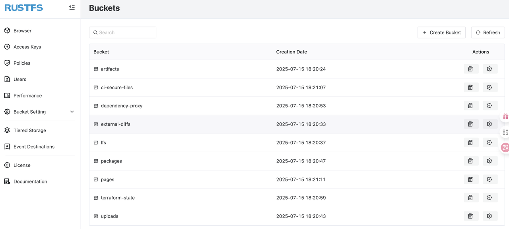
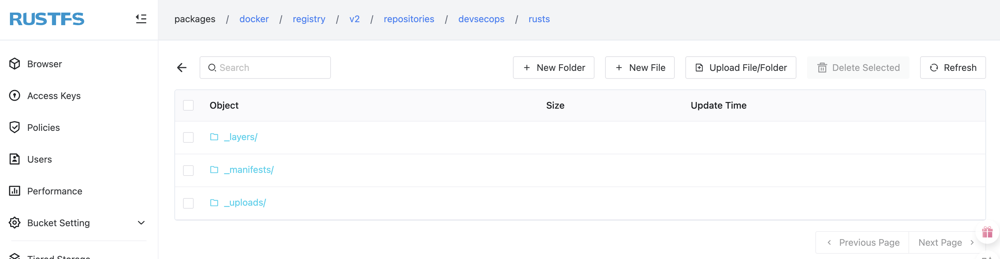

# 关于 GitLab

[GitLab](https://about.gitlab.com) 是全球知名的一体化 DevSecOps 平台，功能涵盖整个软件开发生命周期。由于支持私有化部署，因此在国内外有数千万用户。[GitLab 支持将对象存储作为数据存储后端](https://docs.gitlab.com/administration/object_storage/)，其中就包括 MinIO。由于 RustFS 是 MinIO 的完全平替，因此可以将 RustFS 配置为 GitLab 的对象存储后端。

## 前提条件

- 一个可用的 GitLab 实例。可查看[GitLab 官网安装指南](https://about.gitlab.com/install)
- 一个可用的 RustFS 实例。可遵照[RustFS 安装](../installation/index.md)章节进行创建。
- 可用的 RustFS 访问令牌。可遵照[访问令牌管理](../administration/iam/access-token.md)章节进行创建。

## 在 GitLab 中配置 RustFS

### 创建 RustFS 存储桶

可以为 GitLab 的不同功能（支持将数据存储在对象存储中的功能）创建不同的存储桶，比如 `artifacts`、`ci-secure-files`、`dependency-proxy`、`external-diffs`、`lfs`、`packages`、`pages`、`terraform-state`、`uploads`。RustFS 存储桶的创建可参考 [RustFS 存储桶管理](../management/bucket/creation.md)章节。





### 修改 `gitlab.rb` 配置文件

GitLab 中关于对象存储的配置都在文件 `gitlab.rb`（默认为 `/etc/gitlab/gitlab.rb`）中。以 `packages` 后端配置为例，配置信息如下：

```ruby
gitlab_rails['packages_enabled'] = true # 启动 packages 功能
gitlab_rails['packages_object_store_enabled'] = true # 为 packages 启动对象存储
gitlab_rails['packages_object_store_proxy_download'] = false
gitlab_rails['packages_object_store_remote_directory'] = "packages" # 远端存储对象对应的存储桶
gitlab_rails['packages_object_store_connection'] = {
    'provider' => 'AWS', #对象存储 provider，暂时为 AWS
    'endpoint' => 'http://example.rustfs.com:9000',
    'region' => 'cn-east-1', # rustfs 的 Region 默认为 `cn-east-1`
    'aws_access_key_id' => 'aws_access_key_id', # rustfs access key
    'aws_secret_access_key' => 'aws_secret_access_key', # rustfs secret key
    'path_style' => true,
    'enable_signature_v4_streaming' => false,
    'host' => 'example.rustfs.com',
}
```

重点包括以下几个参数：

- `packages_object_store_enabled`：是否启用对象存储，`true` 代表启动，`false` 代表禁用。**只有这个参数为 `true`**后面的配置才会生效。
- `packages_object_store_remote_directory`：RustFS 实例上的存储桶名称。
- `packages_object_store_connection`：RustFS 实例的链接信息，主要包括 RustFS 实例地址、访问令牌等。

修改完配置以后，执行 `reconfigure` 命令，让配置生效：

```bash
sudo gitlab-ctl reconfigure
```

> 对于 `artifacts`、`ci-secure-files`、`dependency-proxy`、`external-diffs`、`lfs`、`pages`、`terraform-state`、`uploads` 的配置都类似，在此不做赘述。切记，修改配置以后要执行 `sudo gitlab-ctl reconfigure` 让配置生效。

### 配置验证

使用 GitLab 相应功能后，数据就会存储到后端配置的 RustFS 存储桶中。以上一步中的 `packages` 为例，上传一个 Docker 容器镜像到 GitLab 项目镜像仓库：

```bash
# 登录 GitLab 内置容器镜像仓库
docker login example.gitlab.com:5050

# 构建容器镜像
docker build -t example.gitlab.com/rustfs/rusts .

# 推送到 GitLab 内置的容器镜像仓库
docker push example.gitlab.com:5050/rustfs/rusts
```

镜像数据就以对象的方式存储到 `packages` 存储桶中。

