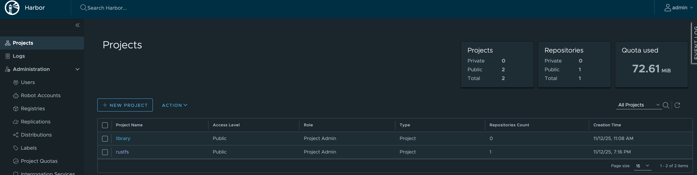
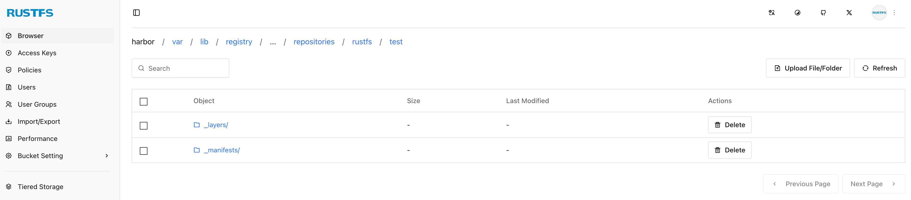

## 关于 Harbor

[Harbor](https://goharbor.io/docs) 是一个企业级的容器镜像存储系统，也是一个 CNCF 的毕业项目。Harbor 支持通过配置存储服务来将数据存储在远端存储系统，而不是存储在本地仓库。RustFS 作为一个兼容 S3 协议的对象存储系统，可以配置为 Harbor 的后端存储服务。


## 前提条件

* 一个运行良好的 RustFS 实例（关于 RustFS 的不同安装方式，可以查看[安装](../installation/index.md)章节）。


## 安装 Harbor

根据[Harbor](https://goharbor.io/docs/1.10/install-config/)官网安装指南，下载安装包，在 `harbor.yml` 文件中添加与存储相关的配置：

```
  s3:
    accesskey: rustfsadmin
    secretkey: rustfsadmin
    region: cn-east-1
    regionendpoint: https://example.rustfs.com
    forcepathstyle: true
    skipverify: true
    secure: false
    encrypt: false
    v4auth: true
    chunksize: 5242880
    bucket: harbor
    rootdirectory: /var/lib/registry
    loglevel: debug
```

关于上述 S3 相关参数的具体含义，可以查看 [Harbor 官网](https://distribution.github.io/distribution/storage-drivers/s3/)。

同时需要在 `harbor.yml` 文件中配置 harbor 的访问地址，比如主机 IP 为 1.2.3.4，且通过 https 来访问：

```
hostname: 1.2.3.4

http:
  # port for http, default is 80. If https enabled, this port will redirect to https port
  port: 8080
```

进行安装前准备检查， 执行 `prepare` 命令，然后执行 `install` 命令：

```
./install.sh 

[Step 0]: checking if docker is installed ...

Note: docker version: 29.0.0

[Step 1]: checking docker-compose is installed ...

Note: Docker Compose version v2.40.3
..........                                                                                                                                             2.7s 
✔ ----Harbor has been installed and started successfully.----
```

等所有容器启动成功，然后用 `http://1.2.3.4:8080` 登陆 Harbor 实例，用户名和密码为 `admin/Harbor12345`。

## 创建 Harbor 项目

在 Harbor 页面上创建要存储镜像的项目，比如 `rustfs`：



## 上传镜像到 Harbor

### 登陆 Harbor

```
docker login 1.2.3.4:8080 -u admin
Password: Harbor12345
Login Succeeded
```

### 制作镜像

可以自行构建镜像，也可以直接从 Dockerhub 拉取镜像并用 tag 进行修改：

```
# 拉取镜像
docker pull rustfs/rustfs:latest
latest: Pulling from rustfs/rustfs
Digest: sha256:4ef4101f5817e82ba93a2c12074627b2a42b84e5482d534d6ed8a960a9b2e192
Status: Image is up to date for rustfs/rustfs:latest
docker.io/rustfs/rustfs:latest

# 重新 tag 镜像
docker tag rustfs/rustfs:latest 1.2.3.4:8080/rustfs/test:1.0.0
```

### 推送镜像

使用 push 命令将上面的镜像推送到 Harbor rustfs 项目中：

```
docker push 1.2.3.4:8080/rustfs/test:1.0.0
The push refers to repository [1.2.3.4:8080/rustfs/test]
c3bc499db1ab: Layer already exists 
9398b321ad6a: Layer already exists 
14d5f6cee2c2: Layer already exists 
4f4fb700ef54: Layer already exists 
2d35ebdb57d9: Layer already exists 
87326a4e5c2b: Layer already exists 
c84d56f5f1d5: Layer already exists 
1.0.0: digest: sha256:7e393feb5915e11977a236be7886d631563fb4145bff8ac5f2747cbf0c887101 size: 1680

i Info → Not all multiplatform-content is present and only the available single-platform image was pushed
         sha256:4ef4101f5817e82ba93a2c12074627b2a42b84e5482d534d6ed8a960a9b2e192 -> sha256:7e393feb5915e11977a236be7886d631563fb4145bff8ac5f2747cbf0c887101
```

## 验证

登录 `harbor.yml` 文件中配置的 RustFS 实例并查看 Harbor 是否将镜像数据存储到该实例：



