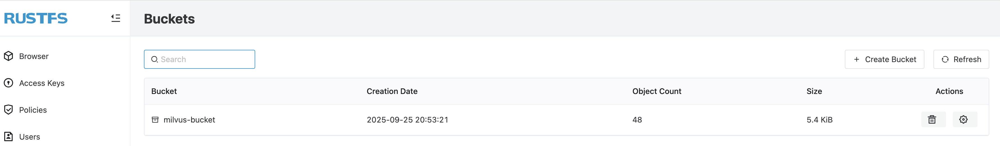
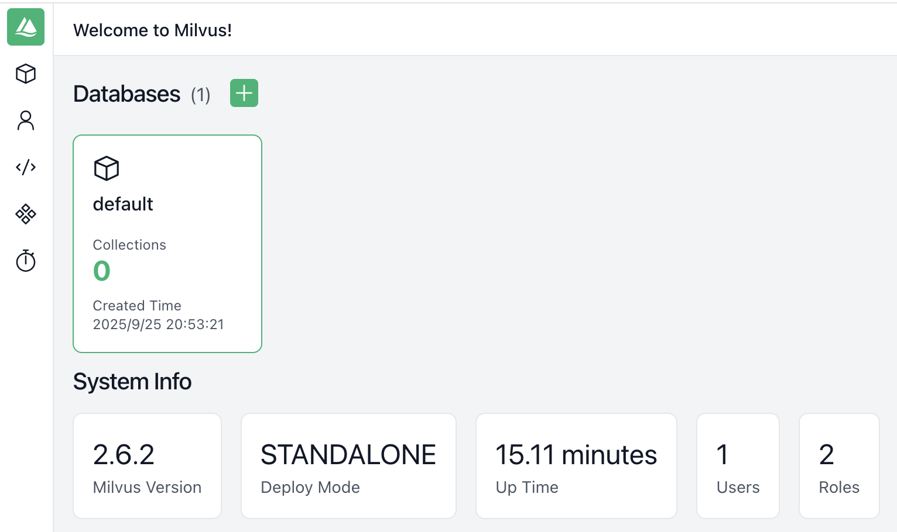

# 在 Milvus 中配置 RustFS


[Milvus](https://milvus.io/) 是一款开源的向量数据库项目，由 Zilliz 开发，目前该项目已经捐赠给了 LF AI & DATA 基金会。向量数据库是 AIGC 发展的重要基础设施，因此 [milvus 在 GitHub 上的 Star 数量](https://github.com/milvus-io/milvus)已经超过 37.5k。

Milvus 支持多种安装方式，同时支持将对象存储配置为存储后端，官方提供的配置方式中，默认的对象存储为 minio。RustFS 作为 Rust 编写的新一代分布式对象存储系统，可以完全平替 minio，因此，可以将 RustFS 作为 milvus 的对象存储后端。

## 配置流程

### Docker Compose 安装

#### `docker-compose.yaml` 文件修改

Milvus 官方提供 [`docker-compose.yml`](https://github.com/milvus-io/milvus/blob/master/docker-compose.yml)来进行部署。该文件中包含以下几个服务：


- `milvus-etcd`
- `milvus-minio`
- `milvus-standalone`


将 `milvus-minio` 替换为 `milvus-rustfs`，需要将 `docker-compose.yaml` 中的 minio 容器信息替换为 rustfs 容器信息：

```
  rustfs:
    container_name: milvus-rustfs
    image: rustfs/rustfs:1.0.0-alpha.58
    environment:
      - RUSTFS_VOLUMES=/data/rustfs0,/data/rustfs1,/data/rustfs2,/data/rustfs3
      - RUSTFS_ADDRESS=0.0.0.0:9000
      - RUSTFS_CONSOLE_ADDRESS=0.0.0.0:9001
      - RUSTFS_CONSOLE_ENABLE=true
      - RUSTFS_EXTERNAL_ADDRESS=:9000
      - RUSTFS_CORS_ALLOWED_ORIGINS=*
      - RUSTFS_CONSOLE_CORS_ALLOWED_ORIGINS=*
      - RUSTFS_ACCESS_KEY=rustfsadmin
      - RUSTFS_SECRET_KEY=rustfsadmin
    ports:
      - "9000:9000" # S3 API port
      - "9001:9001" # Console port
    volumes:
      - rustfs_data_0:/data/rustfs0
      - rustfs_data_1:/data/rustfs1
      - rustfs_data_2:/data/rustfs2
      - rustfs_data_3:/data/rustfs3
      - logs_data:/app/logs
    restart: unless-stopped
    healthcheck:
      test:
        [
          "CMD",
          "sh", "-c",
          "curl -f http://localhost:9000/health && curl -f http://localhost:9001/health"
        ]
      interval: 30s
      timeout: 10s
      retries: 3
      start_period: 40s
```

另外，在 `milvus-standalone` 容器信息中 `depends` 中的 minio 替换为 rustfs：

```
    depends_on:
      - "etcd"
      - "rustfs"
```

如果想增加 milvus 的可观测性，还可以在 `docker-compose.yaml` 文件中增加 attu 服务：

```
  attu:
    container_name: milvus-attu
    image: zilliz/attu:v2.6
    environment:
      - MILVUS_URL=milvus-standalone:19530
    ports:
      - "8000:3000"
    restart: unless-stopped
```

#### `milvus.yaml` 文件修改


minio 的信息（包括地址、access_key、access_secret 等）都写在 [`milvus.yaml`](https://github.com/milvus-io/milvus/blob/master/configs/milvus.yaml) 中，因此需要将这些信息替换为 rustfs 实例的信息：

在该文件中，minio 的重点配置信息如下：

```
rustfs:
  address: localhost:9000
  port: 9000
  accessKeyID: rustfsadmin
  secretAccessKey: rustfsadmin
  useSSL: false
  bucketName: "rustfs-bucket"
```

**注意**：由于需要修改 `milvus.yaml` 文件中的默认 minio 信息，因此有两种方式：

- 修改 `milvus-standalone` 容器的启动命令：在 milvus 进程启动之前，使用 `yq` 命令对 minio 信息进行替换。由于该容器中默认没有 `yq` 命令，所以需要先安装。
- 从本地挂载：将 `milvus.yaml` 文件下载到本地，修改内容后，使用 volume 进行挂载，比如 `- ${DOCKER_VOLUME_DIRECTORY:-.}/milvus.yaml:/milvus/configs/milvus.yaml:ro`

### 安装部署

将官方 [`docker-compose.yml`](https://github.com/milvus-io/milvus/blob/master/docker-compose.yml) 和 [`milvus.yml`](https://github.com/milvus-io/milvus/blob/master/configs/milvus.yaml)下载到本地。根据上面的步骤进行相应修改，然后执行如下命令：

```bash
docker compose -f docker-compose.yaml up -d
```

等服务启动之后，可查看启动的容器：

```bash
docker compose ps
NAME                IMAGE                          COMMAND                  SERVICE      CREATED          STATUS                      PORTS
milvus-attu         zilliz/attu:v2.6               "docker-entrypoint.s…"   attu         14 minutes ago   Up 14 minutes               0.0.0.0:8000->3000/tcp, [::]:8000->3000/tcp
milvus-etcd         quay.io/coreos/etcd:v3.5.18    "etcd -advertise-cli…"   etcd         14 minutes ago   Up 14 minutes (healthy)     2379-2380/tcp
milvus-rustfs       rustfs/rustfs:1.0.0-alpha.58   "/entrypoint.sh rust…"   rustfs       14 minutes ago   Up 14 minutes (unhealthy)   0.0.0.0:9000-9001->9000-9001/tcp, [::]:9000-9001->9000-9001/tcp
milvus-standalone   milvusdb/milvus:v2.6.2         "/tini -- milvus run…"   standalone   14 minutes ago   Up 14 minutes (healthy)     0.0.0.0:9091->9091/tcp, [::]:9091->9091/tcp, 0.0.0.0:19530->19530/tcp, [::]:19530->19530/tcp
```

其中，RustFS 服务在 `localhost:9000` 可用：




可以看到，milvus 已经使用 rustfs 存储了一些启动过程中产生的数据。


Attu 在 `localhost:8000` 可用：


