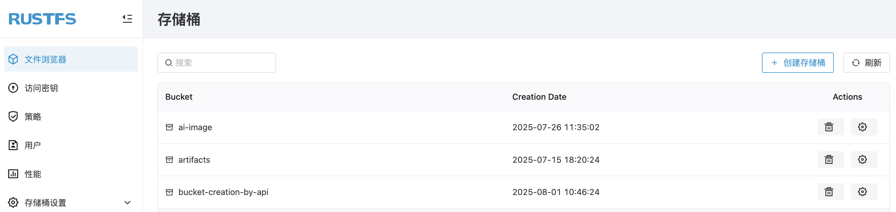

# RustFS 存储桶创建

本章节分享通过 RustFS UI、`mc`（MinIO Client）或 API 来对存储桶进行创建。

## 创建存储桶

前提条件：

- 一个可用的 RustFS 实例。可参考[安装指南](../../installation/index.md)进行安装。

## 在 RustFS UI 上创建存储桶

1. 登录 RustFS UI 控制台。
1. 在首页，左上角，选择 **创建存储桶**。
1. 输入存储桶名称，点击 **创建** 完成存储桶的创建。



### 使用 `mc` 创建存储桶

> 对于 `mc` 的安装和配置可以查看[`mc` 使用指南](../../developer/mc.md)章节。

使用 `mc mb` 命令创建存储桶：

```
# creat rustfs bucket
mc mb rustfs/bucket-creation-by-mc
Bucket created successfully `rustfs/bucket-creation-by-mc`.

# confirm bucket creation
mc ls rustfs/bucket-creation-by-mc
```

### 使用 API 创建存储桶

使用如下 API 来创建存储桶：

```
PUT /{bucketName} HTTP/1.1
```

请求示例：

```
curl --location --request PUT 'http://12.34.56.78:9000/bucket-creation-by-api' \
--header 'X-Amz-Content-Sha256: e3b0c44298fc1c149afbf4c8996fb92427ae41e4649b934ca495991b7852b855' \
--header 'X-Amz-Date: 20250801T023519Z' \
--header 'Authorization: AWS4-HMAC-SHA256 Credential=H4xcBZKQfvJjEnk3zp1N/20250801/cn-east-1/s3/aws4_request, SignedHeaders=host;x-amz-content-sha256;x-amz-date, Signature=c2fb2ba5199a30ebcfa9976d0f35000ba274da3701327957e84ea0f3920288f2'
```

在 RustFS UI 上可以确认 `bucket-creation-by-api` 存储桶已经创建成功。
