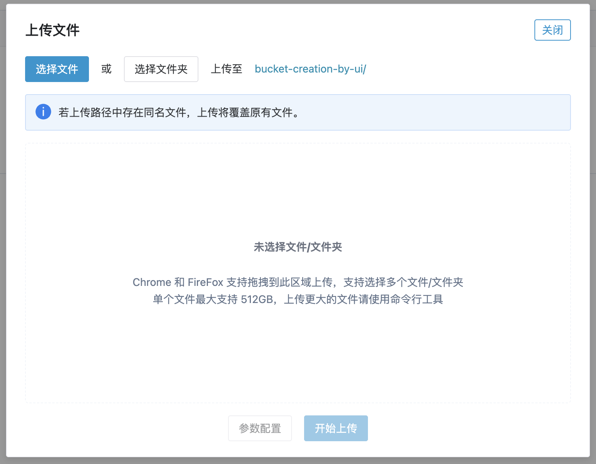
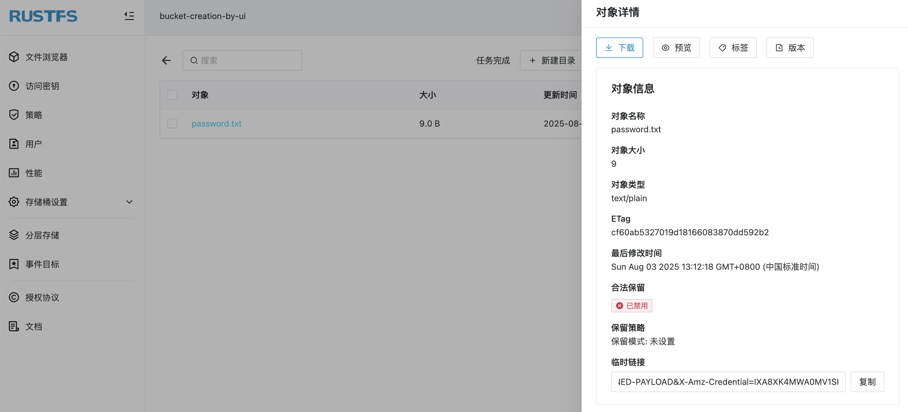
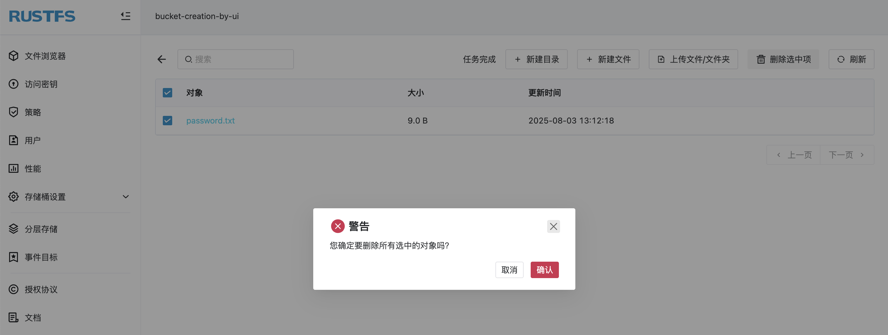

# RustFS 对象

对象（Object）是 RustFS 存储的基本单元，包含数据、元数据和唯一标识符（Object Key）。数据以对象的形式存储。本章节以文件的上传和删除为例，介绍对象的管理。

> 关于对象（Object）相关的概念，可以查看[核心概念](../../concepts/glossary.md)章节。

## 创建对象

前提条件：

- 一个可用的 RustFS 实例。可参考[安装指南](../../installation/index.md)进行安装。

[创建一个存储桶](../bucket/creation.md)，然后上传文件至存储桶，就会完成对象的创建。可以通过 RustFS UI、`mc` 以API 方式上传文件。

### 在 RustFS UI 上上传文件

1. 登录 RustFS UI 控制台。
1. 选择要上传文件的存储桶。
1. 在存储桶页面，右上角，选择**新建目录**、**新建文件**或**上传文件/文件夹** 来完成文件/文件夹的创建。
1. 如从本地上传文件/文件夹。点击 **上传文件/文件夹** 按钮，选择本地文件/文件夹，点击 **开始上传** 完成文件的上传。



上传完毕，点击该对象可查看对象的详细信息。



### 使用 `mc` 上传文件

> 对于 `mc` 的安装和配置可以查看[`mc` 使用指南](../../developer/mc.md)章节。

使用 `mc cp` 命令上传文件：

```
# upload file
mc cp 1.txt rustfs/bucket-creation-by-mc
/tmp/1.txt:            13 B / 13 B  ▓▓▓▓▓▓▓▓▓▓▓▓▓▓▓▓▓▓▓▓▓▓▓▓▓▓▓▓▓▓▓▓▓▓▓▓▓▓▓  61 B/s 0s%

# confirm file uploaded
mc ls rustfs/bucket-creation-by-mc
[2025-08-01 10:01:08 CST]    13B 1.txt
```

上传完毕，可以在 RustFS 控制台上进行查看。

### 使用 API 上传文件

使用如下 API 进行文件上传：

```
PUT /{bucketName}/{objectName} HTTP/1.1
```

请求示例：

```
curl --location --request PUT 'http://12.34.56.78:9000/bucket-creation-by-api/password.txt' \
--header 'Content-Type: text/plain' \
--header 'X-Amz-Content-Sha256: e3b0c44298fc1c149afbf4c8996fb92427ae41e4649b934ca495991b7852b855' \
--header 'X-Amz-Date: 20250801T024840Z' \
--header 'Authorization: AWS4-HMAC-SHA256 Credential=H4xcBZKQfvJjEnk3zp1N/20250801/cn-east-1/s3/aws4_request, SignedHeaders=content-length;content-type;host;x-amz-content-sha256;x-amz-date, Signature=b7d8dc29ee34dfdf1f3e9e8e069892a8936f478586e7a2c90cf34f5b86d3a2dc' \
--data-binary '@/path/to/password.txt'
```

上传完毕，可以在 RustFS 控制台上进行查看。

## 删除对象

同样可以在 UI 上、使用 `mc` 或 API 方式删除对象。比如将上面步骤中创建的文件进行删除，即可完成对象的删除。

## 在 RustFS UI 上删除文件

1. 登录 RustFS UI 控制台。
1. 选择要删除文件的存储桶。
1. 在存储桶页面，选择要删除的文件。
1. 点击右上角的 **删除选中项**，在弹出的对话框中点击 **确认** 完成文件的删除。



### 使用 `mc` 删除文件

使用 `mc rm` 命令删除文件：

```
# delete file
mc rm rustfs/bucket-creation-by-mc/1.txt
Removed `rustfs/bucket-creation-by-mc/1.txt`.

# confirm deletion
mc ls  rustfs/bucket-creation-by-mc/1.txt
```

可以 RustFS UI 上确认文件已经删除。

### 使用 API 删除文件

使用如下 API 进行文件删除：

```
DELETE /{bucketName}/{objectName} HTTP/1.1
```

请求示例：

```
curl --location --request DELETE 'http://12.34.56.78:9000/bucket-creation-by-api/password.txt' \
--header 'Content-Type: text/plain' \
--header 'X-Amz-Content-Sha256: e3b0c44298fc1c149afbf4c8996fb92427ae41e4649b934ca495991b7852b855' \
--header 'X-Amz-Date: 20250801T030822Z' \
--header 'Authorization: AWS4-HMAC-SHA256 Credential=H4xcBZKQfvJjEnk3zp1N/20250801/cn-east-1/s3/aws4_request, SignedHeaders=content-length;content-type;host;x-amz-content-sha256;x-amz-date, Signature=1ee63bb0b699598602b2fdbd013e355a57bcb9991307a8ad41f6512e8afebf3a' \
--data-binary '@/Users/jhma/Desktop/password.txt'
```

可在 RustFS UI 上确认文件已经删除。
